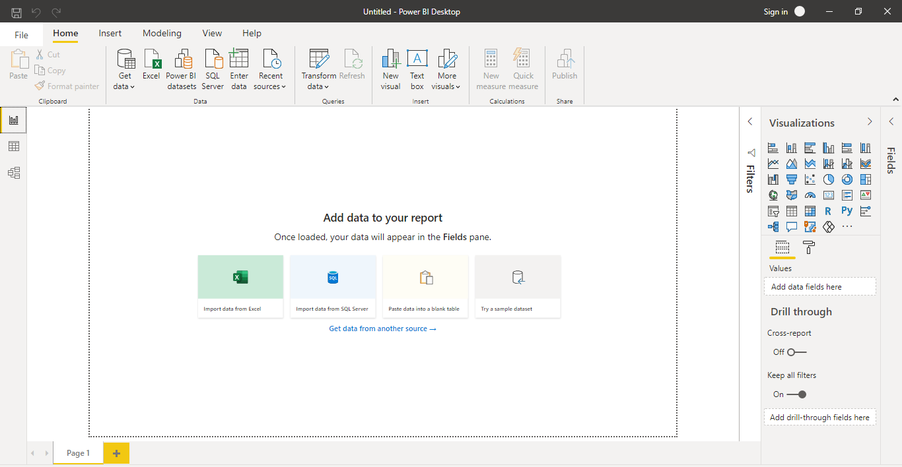
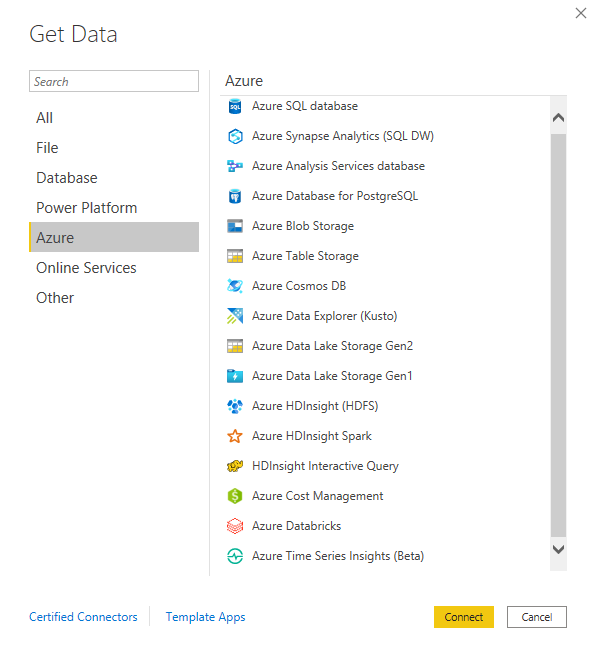
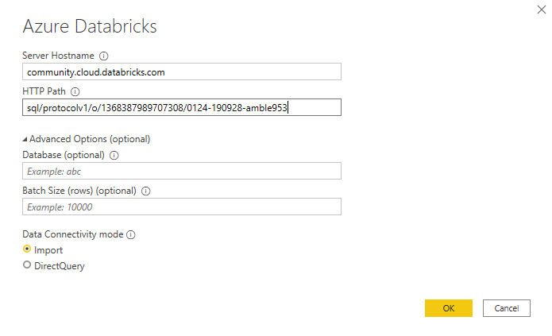
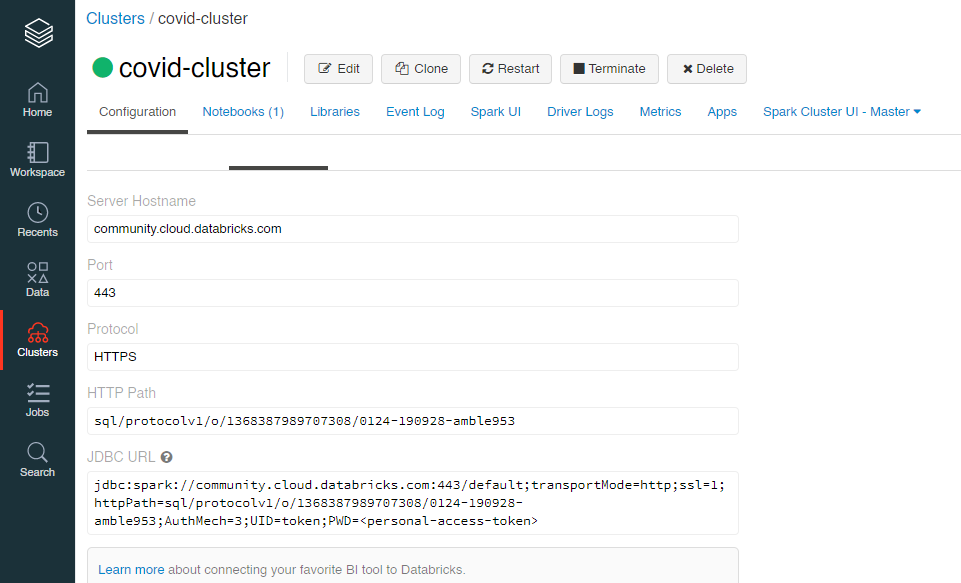
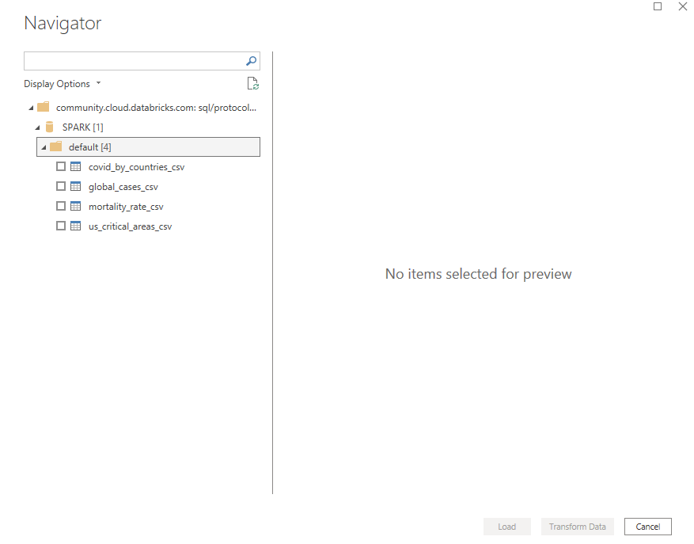
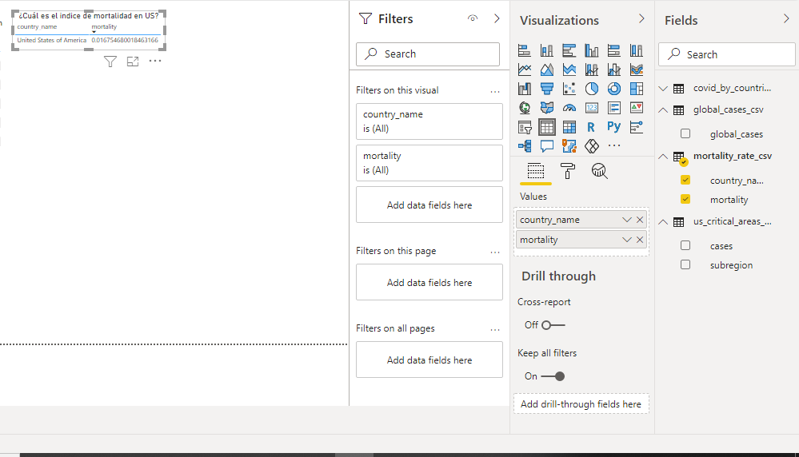
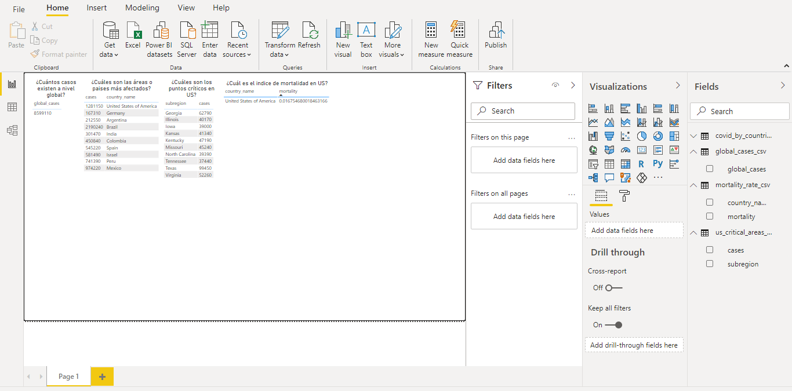
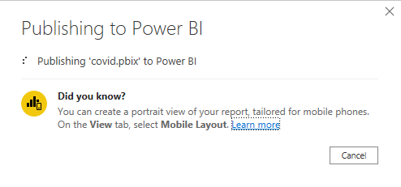
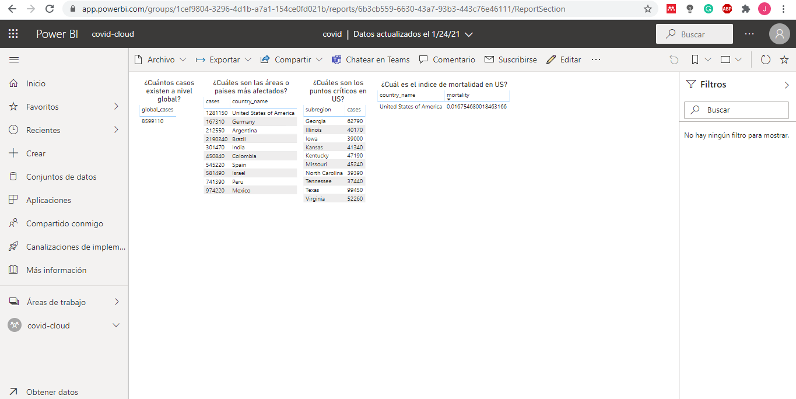

# Computación en la Nube - Tarea 1

El propósito de este reporte es aplicar las tecnologías y procedimientos aprendidos en la materia Computación en la Nube, y ejecutar los siguientes procedimientos:

1. Construir de una ETL que permita leer los datos de la base **covid19-open-data** y almacenarlos en un sistema de almacenamiento propio (BlobStorage/s3).
1. Leer los datos extraídos en el sistema de almacenamiento propio, usando tecnologías como Databricks o Aws Athena.
1. Ejecutar un conjunto de consutlas SQL sobre los datos extraídos.
1. Conectar Power BI al sistema donde fueron ejecutadas las consultas, para permitir su visualización.

# Tabla de Contenido

- [Computación en la Nube - Tarea 1](#computación-en-la-nube---tarea-1)
- [Tabla de Contenido](#tabla-de-contenido)
  - [Creación de la ETL](#creación-de-la-etl)
    - [Creación del Bucket en Aws S3](#creación-del-bucket-en-aws-s3)
    - [Leer y guardar datos en Databricks](#leer-y-guardar-datos-en-databricks)
    - [Obtener keys de acceso a Aws](#obtener-keys-de-acceso-a-aws)
  - [Reproducir consultas SQL con Databriks](#reproducir-consultas-sql-con-databriks)
  - [Creación de tablas en Databricks](#creación-de-tablas-en-databricks)
  - [Visualización de las consultas en Power BI](#visualización-de-las-consultas-en-power-bi)
    - [Instalación Power BI](#instalación-power-bi)
    - [Obtener HostName y HTTP Path de Databricks](#obtener-hostname-y-http-path-de-databricks)
    - [Visualizar consultas en Power BI Desktop](#visualizar-consultas-en-power-bi-desktop)

## Creación de la ETL

Antes de crear la ETL para consumir los datos de la fuente covid19-open-data, debemos crear un contenedor de archivos para almacenar la información cuando ejecutemos el proceso de extracción. Para esta parte, se optó por utilizar un bucket de S3 en Aws, que permita almacenar la data.

### Creación del Bucket en Aws S3

Ingresaremos a la consola de Aws y en la barra de búsqueda ingresaremos el nombre S3; luego haremos clic en el primer servicio que se muestra en la lista.


Una vez ingresemos al portal de S3, vamos a hacer clic en el botón **Create Bucket** que aparece en la parte derecha de la página.


Este botón nos llevará a un formulario para la creación del bucket. Una vez allí, ingresaremos el nombre del bucket en el campo **Bucket name** y finalizaremos la creación presionando el botón **Create Bucket** que se muestra al final del formulario.


Una vez creado el bucket, nos debería aparecer un nuevo registro en la lista de buckets existentes.


### Leer y guardar datos en Databricks

Una vez hemos creado el bucket, ingresaremos a la página de Databricks Community e iniciaremos sesión con nuestro usuario y contraseña.

En la página principal haremos clic en la opción **Clusters** del menú principal y luego presionaremos el botón **Create Cluster** para crear nuestra infraestructura de procesamiento.


A continuación, se nos mostrara un formulario para la creación del cluster. En el campo **Cluster Name** ingresaremos el nombre que deseemos para nuestro cluster. Las demás opciones no las modificaremos para este caso de uso. Finalizaremos este proceso presionando el botón **Create Cluster** que aparece en la parte superior.


Una vez finalizada la creación del cluster, nos aparecerá un nuevo registro en la lista de clusters.


El siguiente paso es crear un Notebook que será nuestro espacio de trabajo para la ETL. Para ello, presionaremos en el logo de Databricks que nos llevará a la página principal y haremos clic en la opción **New Notebook**.


En el formulario que se abrirá a continuación, ingresaremos el nombre del Notebook, el lenguaje de programación con el cual deseemos trabajar y seleccionaremos el cluster que hemos creado. Finalizaremos la creación haciendo clic en el botón **Create**.

Una vez estemos en nuestro nuevo Notebook, vamos a agregaremos los siguientes comandos para crear la ETL:

- Para leer el dataset **covid19-open-data**, ejecutaremos el siguiente código para descargar el archivo del siguiente [link](https://storage.googleapis.com/covid19-open-data/v2/main.csv):

```
url = "https://storage.googleapis.com/covid19-open-data/v2/main.csv"

from pyspark import SparkFiles
spark.sparkContext.addFile(url)
```

- Una vez hemos leído el archivo desde nuestra fuente de datos, vamos a cargarlo en un dataframe de Spark.

```
df = spark.read.csv("file://"+SparkFiles.get("main.csv"), header=True, inferSchema= True)
```

- Para tener acceso a nuestro bucket de S3, crearemos una unidad de montaje que nos permitirá tener referencia a nuestro sistema de almacenamiento:

```
access_key = "XXXXXXXXXXXXXXX"
secret_key = "XXXXXXXXXXXXX"
encoded_secret_key = secret_key.replace("/", "%2F")
aws_bucket_name = "<bucket_name>"
mount_name = "<folder_name>"

dbutils.fs.mount(source = "s3a://%s:%s@%s" % (access_key, encoded_secret_key, aws_bucket_name), mount_point = "/mnt/%s" % mount_name)
```

- Ahora ejecutaremos el siguiente código para guardar el dataframe en nuestro bucket:

```
out = "/mnt/<folder_name>/<s3_folder>"
df.write.option("header","true").csv(out)
```

- Una vez se ha ejecutado todos los pasos anteriores, tendremos nuestros archivos en el bucket de S3.


El Notebook que contiene los códigos anteriores puede accederse a través del siguiente [link](https://databricks-prod-cloudfront.cloud.databricks.com/public/4027ec902e239c93eaaa8714f173bcfc/1368387989707308/2228990396878086/6696879192669646/latest.html).

### Obtener keys de acceso a Aws

La creación de la unidad de montaje en el paso anterior, requiere de un **access key** y **secret key** para tener acceso al bucket de S3. Estos valores se pueden obtener a través de la consola de Aws, ingresando a la opción de **My Security Credentiales** que aparece en el menú desplegable cuando hacemos clic en nuestro usuario.


Una vez hemos ingresado en la página, iremos a la sección **Access Keys** y haremos clic en el botón **Create New Access Key** para generar un par de claves.


A continuación, se mostrará un modal con el par de claves y este nos mostrará la opción de descargar un archivo con la información.

## Reproducir consultas SQL con Databriks

Para este paso, vamos a crear un nuevo Notebook en Databricks, para ejecutar las consultas.

Los pasos a seguir son los siguientes:

- Primero, crearemos una unidad de montaje para tener acceso a al bucket de S3 que contiene los archivos que almacenó la ETL. Esto lo podemos hacer con el siguiente código:

```
access_key = "XXXXXXXXXXXXXXX"
secret_key = "XXXXXXXXXXXXX"
encoded_secret_key = secret_key.replace("/", "%2F")
aws_bucket_name = "<bucket_name>"
mount_name = "<folder_name>"

dbutils.fs.mount(source = "s3a://%s:%s@%s" % (access_key, encoded_secret_key, aws_bucket_name), mount_point = "/mnt/%s" % mount_name)
```

- Una vez creada la unidad de montaje, leeremos los archivos que se encuentran en el bucket, a través de los siguientes comandos:

```
path = "/mnt/<folder_name>/<s3_folder>/"
df = spark.read.format("csv").option("header", "true").load("%s/*" % path)
```

- Ahora crearemos una vista SQL temporal a partir de nuestro dataframe:

```
df.createOrReplaceTempView("<view_name>")
```

- Con el siguiente comando ejecutaremos una de las consultas SQL requeridas, la cual consiste en obtenerla cantidad de casos de COVID-19 a nivel mundial:

```
sqlDF = spark.sql("SELECT count(1) as CASOS_NIVEL_GLOBAL FROM covid LIMIT 10")
sqlDF.show()
```

- El código anterior debería imprimir una tabla como la que se mostrará a continuación:


- Finalizaremos la consulta, guardándola la consulta (dataframe) en el sistema de almacenamiento interno de Spark, usando el siguiente comando:

```
out = "dbfs:/FileStore/<folder_name>/<file_name>.csv"
sqlDF.write.format("com.databricks.spark.csv").option("header","true").csv(out)
```

El resto de las consultas pueden verse en el Notebook de Databriks [link](https://databricks-prod-cloudfront.cloud.databricks.com/public/4027ec902e239c93eaaa8714f173bcfc/1368387989707308/4244740782447881/6696879192669646/latest.html).

## Creación de tablas en Databricks

Una vez hemos ejecutados las consultas y hemos almacenado los resultados en el sistema de almacenamiento de Spark, vamos a crear tablas en Databriks, que serán accesibles a través de Power BI.

- Para ello, vamos a hacer clic en la opción **Data** del menú principal de Databricks y luego haremos clic en el botón **Create Table**.


- En la página que se carga a continuación, seleccionaremos la opción **DBFS**, luego haremos clic en la opción FileStore > tables y finalizaremos haciendo clic en cualquiera de archivos CSV que se encuentra en la carpeta.


- Una vez seleccionado el archivo CSV, haremos clic en el botón **Create Table with UI** y buscaremos el cluster que creamos al inicio de este proceso.


- Luego haremos clic en **Preview Table** para ver la metadata de la tabla y algunas opciones para la creación de la tabla.


**Nota:** Se ha marcado la opción **First row is header** ya que los archivos CSV fueron exportados con su respectivo encabezado.

Finalizaremos este proceso haciendo clic en el botón **Create Table** y repetiremos este proceso para los otros archivos.

Ahora podemos ver que el menú **Data** contiene la lista de tablas que hemos creado.


## Visualización de las consultas en Power BI

### Instalación Power BI

Lo primero que haremos es descargar la versión de escritorio de Power, que podremos bajar a través del siguiente [link](https://powerbi.microsoft.com/es-es/desktop)

Una vez descargada la aplicación, vamos a iniciarla y nos debería aparecer la siguiente visualización:



Haremos clic en la opción **Get Data** del menú superior, la cual, nos abrirá el siguiente modal:



Allí, haremos clic en la opción Azure > Azure Databricks y luego en el botón **Connect**.

En el siguiente cuadro, vamos a ingresar los campos **Server HostName** y **HTTP Path**.



A continuación, mostraremos como podemos obtener estos valores de Databricks.

### Obtener HostName y HTTP Path de Databricks

Una vez en la página principal de Databricks, seleccionaremos la opción **Clusters** del menú principal, la cual nos abrirá una lista de clusters.

Allí haremos harémos clic en el cluster con el cual hemos trabajado y a continuación nos aparecerá su información detallada.

En la parte inferior de la información detallada haremos clic en la opción JDBC/ODBC y nos aparecerán varias credenciales de acceso al cluster.

Aquí podemos encontrar el **Server HostName** y **HTTP Path** de nuestro cluster.



### Visualizar Consultas en Power BI Desktop

Continuando con la visualización en Power BI, ingresaremos el **Server HostName** y **HTTP Path** y haremos clic en el botón **OK**.

Nos debería aparecer un panel con las tablas que habíamos creado manualmente en Databricks.

Vamos a seleccionar todas las tablas y haremos clic en el botón **Load**.



Una vez cargadas las tablas, seleccionaremos el elemento **Table** del menú **Visualization** (sección derecha) y lo arrastraremos hacia nuestro lienzo de trabajo.

En la parte derecha podemos ver que el menú **Fields** contiene las tablas que hemos cargado previamente. Vamos a hacer clic en una de las tablas y esta nos desplegará un menú con los campos que contiene.

Haremos clic en la tabla que se encuentra en el lienzo y también en los atributos de una de las tablas del campo **Fields**. A continuación, la tabla del lienzo nos debería mostrar la información asociada al Datasource que hemos seleccionado.



Repetiremos este proceso para todos los campos de las tablas que hemos cargado de Databricks. El resultado debería ser el siguiente:



Una vez completado este procedimiento, vamos a publicar el el proyecto en la versión web de Power BI. Para ello, haremos clic en la opción **Publish** del menú superior.

Una vez nos hemos autenticados, nos debería mostrar un modal indicando que los cambios se están publicando.



Una vez finalizado este paso, se nos abrirá la versión web de Power BI con nuestro proyecto.



Esto nos indica que nuestros cambios se han publicado correctamente.
