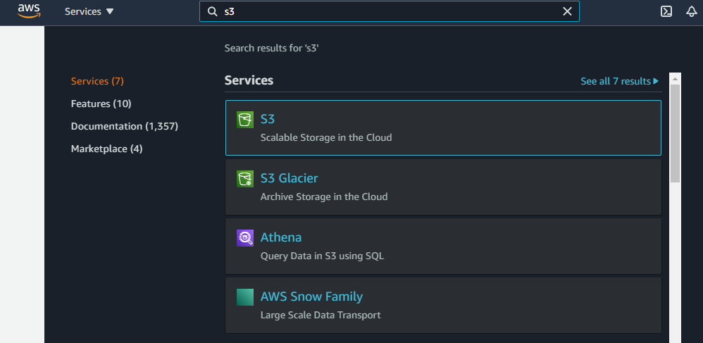
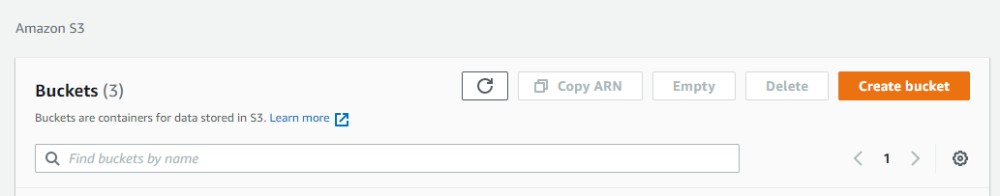
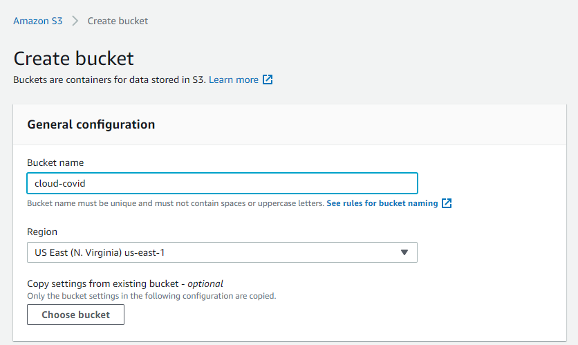
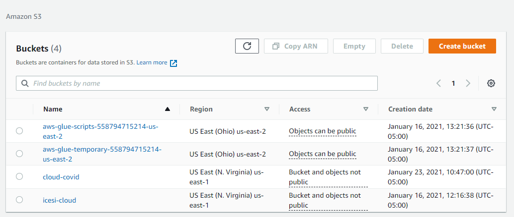
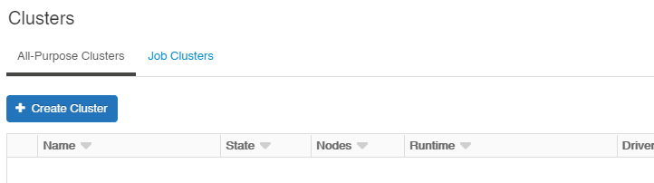
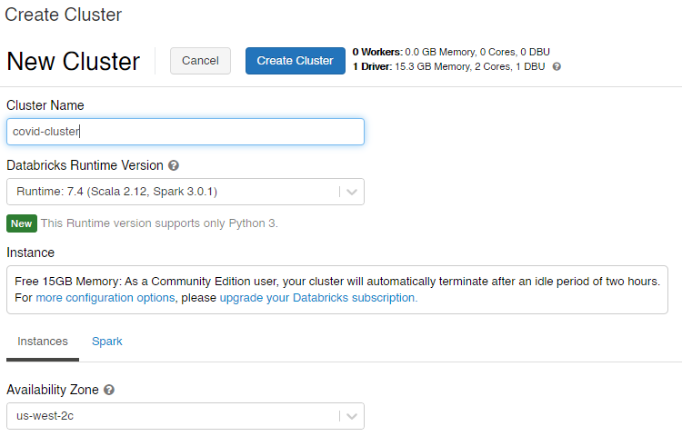
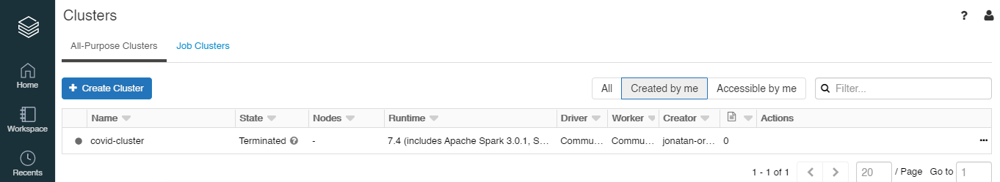
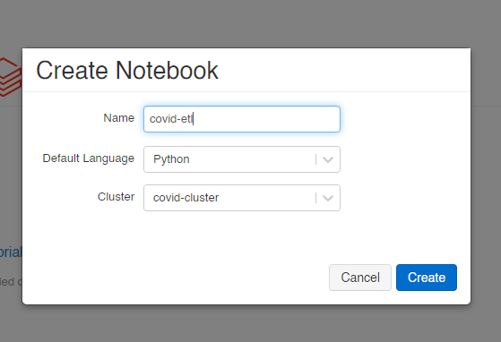

# Computación en la Nube - Tarea 1

El proposito de este reporte es el de aplicar las tecnologías y procedimientos aprendidos en la materia de Computación en la Nube, por medio de la ejecución de las siguientes tareas:

1. Construir de una ETL que permita leer los datos del sistema de archivos. **covid19-open-data** y lmacenarlos en un sistema de almacenamiento propio (BlobStorage/s3).
1. Leer los datos extraidos en el sistema de almacenamiento, usando tecnologías como Databricks o Aws Athena.
1. Ejecutar una serie de consutlas SQL sobre los datos leídos.
1. Conectar el aplicativo Power BI al sistema donde se ejecutaron las consultas, para permitir su visualización a través de los diferentes herramientas que provee este sistema de reportes.

## 1. Creación de la ETL

Antes de crear la ETL para consumir los datos de la fuente covid19-open-data, debemos crear un contenedor de archivos para almacenar la información cuando ejecutemos el proceso de extracción. Para esta parte, se optó por utilizar un bucket de S3 en Aws, que permita almacenar la data.

### Creación del Bucket en Aws S3

Ingresaremos a la consola de Aws y buscaremos S3 en la barra de busqueda de la página (parte superior). Luego haremos clic en el primer servicio que se muestra en la lista.

Una vez ingresemos al portal de S3, vamos a hacer clic en el botón **Create Bucket** que aparece en la parte derecha de la página.

Este botón nos llevará a un formulario. En el campo **Bucket name** ingresaremos el nombre que deseemos para nuestro bucket y finalizaremos la creación presionando el botón **Create Bucket** que se muestra al final del formulario.

Una vez creado el bucket, este nos debería aparecer en la lista de buckets existentes.

### Creación de la ETL con Databricks

Nos logearemos en la versión community de Databricks e iremos a la opción **Clusters** que se encuentra en la parte izquierda. Allí haremos clic en el botón **Create Cluster**.

Se nos mostrará un formulario para la creación del cluster. En el campo **Cluster Name** ingresaremos el nombre que deseemos para nuestro cluster. Las demás opciones no las modificaremos. Finalizaremos este proceso presionando el botón **Create Cluster**.

Una vez finalizada la creación, el cluster nos debería aparecer en la lista mostrada a continuación.

El siguiente paso es crear un Notebook para trabajar nuestra ETL. Para ello, presionaremos en el logo de Databricks para acceder a la página inicial y presionaremos la opción **New Notebook**.

Ingresaremos el nombre del Notebook, un lenguaje de programación y el cluster que hemos creado en pasos anteriores. Finalizamos la creación haciendo clic en el botón **Create**.

3. Link del dataset: https://storage.googleapis.com/covid19-open-data/v2/main.csv
