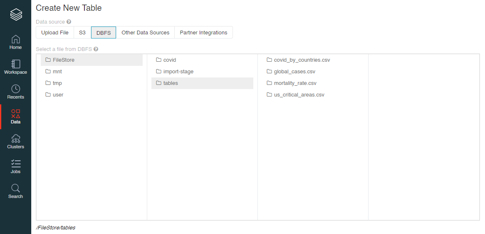

# Computación en la Nube - Tarea 1

El proposito de este reporte es el de aplicar las tecnologías y procedimientos aprendidos en la materia de Computación en la Nube, por medio de la ejecución de las siguientes tareas:

1. Construir de una ETL que permita leer los datos del sistema de archivos. **covid19-open-data** y lmacenarlos en un sistema de almacenamiento propio (BlobStorage/s3).
1. Leer los datos extraidos en el sistema de almacenamiento, usando tecnologías como Databricks o Aws Athena.
1. Ejecutar una serie de consutlas SQL sobre los datos leídos.
1. Conectar el aplicativo Power BI al sistema donde se ejecutaron las consultas, para permitir su visualización a través de los diferentes herramientas que provee este sistema de reportes.

# Tabla de Contenido

- [Computación en la Nube - Tarea 1](#computación-en-la-nube---tarea-1)
- [Tabla de Contenido](#tabla-de-contenido)
  - [Creación de la ETL](#creación-de-la-etl)
    - [Creación del Bucket en Aws S3](#creación-del-bucket-en-aws-s3)
    - [Leer y guardar datos en Databricks](#leer-y-guardar-datos-en-databricks)
    - [Obtener keys de acceso a Aws](#obtener-keys-de-acceso-a-aws)
  - [Reproducir consultas SQL con Databriks](#reproducir-consultas-sql-con-databriks)
  - [Creación de tablas en Databricks](#creación-de-tablas-en-databricks)
  - [Visualización de las consultas en Power BI](#visualización-de-las-consultas-en-power-bi)
    - [Instalación Power BI](#instalación-power-bi)
    - [Obtener HostName y HTTP Path de Databricks](#obtener-hostname-y-http-path-de-databricks)
    - [Visualizar consultas en Power BI Desktop](#visualizar-consultas-en-power-bi-desktop)

## Creación de la ETL

Antes de crear la ETL para consumir los datos de la fuente covid19-open-data, debemos crear un contenedor de archivos para almacenar la información cuando ejecutemos el proceso de extracción. Para esta parte, se optó por utilizar un bucket de S3 en Aws, que permita almacenar la data.

### Creación del Bucket en Aws S3

Ingresaremos a la consola de Aws y buscaremos S3 en la barra de busqueda de la página (parte superior). Luego haremos clic en el primer servicio que se muestra en la lista.


Una vez ingresemos al portal de S3, vamos a hacer clic en el botón **Create Bucket** que aparece en la parte derecha de la página.


Este botón nos llevará a un formulario. En el campo **Bucket name** ingresaremos el nombre que deseemos para nuestro bucket y finalizaremos la creación presionando el botón **Create Bucket** que se muestra al final del formulario.


Una vez creado el bucket, este nos debería aparecer en la lista de buckets existentes.


### Leer y guardar datos en Databricks

Nos logearemos en la versión community de Databricks e iremos a la opción **Clusters** que se encuentra en la parte izquierda. Allí haremos clic en el botón **Create Cluster**.


Se nos mostrará un formulario para la creación del cluster. En el campo **Cluster Name** ingresaremos el nombre que deseemos para nuestro cluster. Las demás opciones no las modificaremos. Finalizaremos este proceso presionando el botón **Create Cluster**.


Una vez finalizada la creación, el cluster nos debería aparecer en la lista mostrada a continuación.


El siguiente paso es crear un Notebook para trabajar nuestra ETL. Para ello, presionaremos en el logo de Databricks para acceder a la página inicial y presionaremos la opción **New Notebook**.


En el formulario ingresaremos el nombre del Notebook, el lenguaje de programación y el cluster que hemos creado en los pasos anteriores. Finalizamos la creación haciendo clic en el botón **Create**.

Una vez creado el Notebook, vamos a ejecutar los siguientes comandos para crear la ETL.

Para leer el dataset **covid19-open-data**, ejecutaremos el siguiente código para descargar el archivo del siguiente [link](https://storage.googleapis.com/covid19-open-data/v2/main.csv):

```
url = "https://storage.googleapis.com/covid19-open-data/v2/main.csv"

from pyspark import SparkFiles
spark.sparkContext.addFile(url)

df = spark.read.csv("file://"+SparkFiles.get("main.csv"), header=True, inferSchema= True)
```

Una vez leído el archivo y cargado en un dataframe de Spark, crearemos una unidad de montaje a nuestro bucket de S3, que no es más que una referencia a nuestro sistema de almacenamiento:

```
access_key = "XXXXXXXXXXXXXXX"
secret_key = "XXXXXXXXXXXXX"
encoded_secret_key = secret_key.replace("/", "%2F")
aws_bucket_name = "<bucket_name>"
mount_name = "<folder_name>"

dbutils.fs.mount(source = "s3a://%s:%s@%s" % (access_key, encoded_secret_key, aws_bucket_name), mount_point = "/mnt/%s" % mount_name)
```

Ahora ejecutaremos el siguiente código para guardar el dataframe en nuestro bucket:

```
out = "/mnt/<folder_name>/<s3_folder>"
df.write.option("header","true").csv(out)
```

Una vez se ha ejecutado todo el código del Notebook, nuestro bucket de S3 debería contener una carpeta con todos los archivos que Spark ha creado para el dataset.


El Notebook creado puede accederse a través del siguiente [link](https://databricks-prod-cloudfront.cloud.databricks.com/public/4027ec902e239c93eaaa8714f173bcfc/1368387989707308/2228990396878086/6696879192669646/latest.html).

### Obtener keys de acceso a Aws

La creación de la unidad de montaje requiere de un **access key** y **secret key** para acceder al bucket de S3. Estos valores se pueden obtener ingresando a la consola de Aws, luego vamos a nuestro usuario en la parte superior derecha y seleccionamos la opción **My Security Credentiales**.


Una vez en la página vamos a la sección **Access Key** y generamos un par de claves.


## Reproducir consultas SQL con Databriks

Ahora vamos a crear un nuevo Notebook en Databricks.

Nuevamente vamos a crear una unidad de montaje para crear una referencia a nuestro bucket de S3. Esto lo podemos hacer con el siguiente código:

```
access_key = "XXXXXXXXXXXXXXX"
secret_key = "XXXXXXXXXXXXX"
encoded_secret_key = secret_key.replace("/", "%2F")
aws_bucket_name = "<bucket_name>"
mount_name = "<folder_name>"

dbutils.fs.mount(source = "s3a://%s:%s@%s" % (access_key, encoded_secret_key, aws_bucket_name), mount_point = "/mnt/%s" % mount_name)
```

Una vez creada la unidad de montaje, vamos a leer los datos particionados que se almacenaron en el bucket de S3, con los siguientes comandos:

```
path = "/mnt/<folder_name>/<s3_folder>/"
df = spark.read.format("csv").option("header", "true").load("%s/*" % path)
```

Ahora vamos a crear una vista temporal de nuestro dataframe usando el siguiente comando:

```
df.createOrReplaceTempView("<view_name>")
```

Por medio del siguiente código, vamos a consultar la cantidad de casos de COVID-19 a nivel mundial:

```
sqlDF = spark.sql("SELECT count(1) as CASOS_NIVEL_GLOBAL FROM covid LIMIT 10")
sqlDF.show()
```

El código anterior debería imprimir una tabla como la que se mostrada a continuación:


Con el siguiente código vamos a guardar la consulta (dataframe) en el sistema de almacenamiento interno de Spark:

```
out = "dbfs:/FileStore/<folder_name>/<file_name>.csv"
sqlDF.write.format("com.databricks.spark.csv").option("header","true").csv(out)
```

El resto de las consultas pueden verse en el siguiente [link](https://databricks-prod-cloudfront.cloud.databricks.com/public/4027ec902e239c93eaaa8714f173bcfc/1368387989707308/4244740782447881/6696879192669646/latest.html).

## Creación de tablas en Databricks

Una vez hemos ejecutados las consultas y almacenado los resultados en el sistema de almacenamiento de Spark, vamos a crear tablas en Databriks para que Power BI pueda acceder a los resultados de las consultas.

Para ello, vamos a hacer clic en la opción **Data** del menú de Databricks y luego haremos clic en el botón **Create Table**.


En la página que nos carga a continuación, vamos a seleccionar como Data Source, la opción **DBFS**. Luego haremos clic en la opción FileStore > tables y haremos clic en uno de los archivos CSV que se encuentra en la carpeta.



Una vez seleccionado el archivo, haremos clic en el botón **Create Table with UI** y seleccionaremos el cluster que creamos al inicio de este proceso.


Luego haremos clic en **Preview Table** para ver la metadata de la tabla y algunas opciones para la creación de la tabla.


**Nota:** Se ha marcado la opción **First row is header** ya que los archivos CSV fueron exportados con su respectivo encabezado. Finalizaremos este proceso haciendo clic en el botón **Create Table**.

Repetiremos este proceso para los otros archivos. Ahora la opción **Data** de Databricks debería mostrar las tablas que hemos creado.


## Visualización de las consultas en Power BI

### Instalación Power BI

Vamos a descargar la versión de escritorio de Power Bi, para visualizar nuestras consultas SQL. Para ello, ingresaremos al siguiente [link](https://powerbi.microsoft.com/es-es/desktop) y haremos clic en el botón **Descargar gratis**.

Una vez descargada la aplicación, vamos a iniciarla. Nos debería aparecer una vista como la que se mostrará a continuación:


Haremos clic en la opción **Get Data** del menú superior. Nos debería mostrar el siguiente modal emergente:


Allí, haremos clic en la opción Azure > Azure Databricks y luego en el botón **Connect**.

En el siguiente cuadro, vamos a ingresar los campos **Server HostName** y **HTTP Path**.


A continuación mostraremos como obtener estos valores de Databricks.

### Obtener HostName y HTTP Path de Databricks

Ingresaremos al panel de Databricks y haremos clic en la opción **Clusters**, luego haremos clic en nuestro cluster y se nos mostrarán los detalles del cluster. En la parte inferior haremos clic en la opción JDBC/ODBC.


Aquí podemos encontrar el **Server HostName** y **HTTP Path** de nuestro cluster.

### Visualizar Consultas en Power BI Desktop

Continuando con la visualización en Power BI, ingresaremos el **Server HostName** y **HTTP Path** y vamos a hacer clic en el botón **OK**.

Nos debería aparecer un panel con las tablas que habíamos creado en el punto anterior. Vamos a seleccionarlas todas y haremos clic en el botón **Load**.


Una vez cargadas las tablas, vamos a seleccionar el elemento **Table** del menú **Visualization** y lo arrastraremos hasta la página en blanco.

En la parte derecha podemos ver el menú **Fields**, que contienen las tablas que hemos cargado en Power BI. Vamos a hacer clic en la tabla que hemos arrastrado al lienzo y seleccionaremos todos los campos de una de las tablas.


Ahora en el lienzo debería mostrarse la información de la consulta.

Repetiremos este proceso para todos los campos de las tablas que hemos cargado de Databricks. El resultado debería ser el siguiente:


Una vez completado este procedimiento, vamos a publicar el lienzo en nuestra versión web de Power BI. Para ello, haremos clic en la opción **Publish** del menú superior.

Una vez autenticados, nos debería mostrar un modal como el siguiente, indicando que los cambios se estan publicando.


Una vez finalizado este paso, podemos ver que se nos abre una página web en nuestro navegador, con el contenido que hemos creado.


Esto nos indica que nuestros cambios se han subido a la versión web de Power BI.
